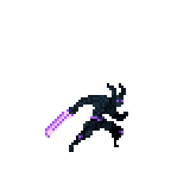
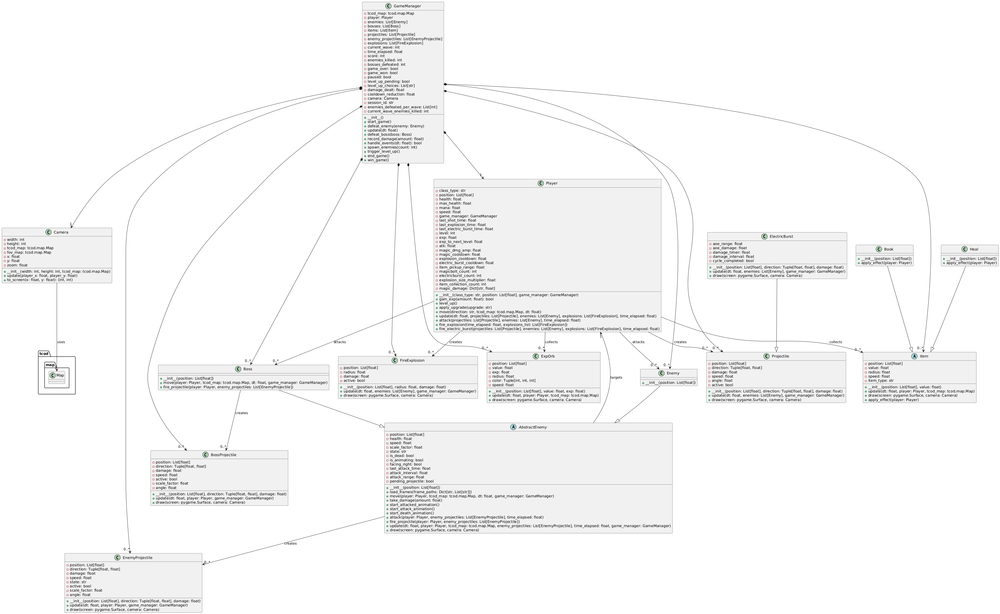

## Project Overview

**Arcane Conquest** is a rouge-like game inspired by vampire survivor, and 20 minutes till dawn. Be a powerful mage that conquer the land of demons, dodge bullet hell, collect experience point, level up, choose your perk, and survive for 3 minutes. The game difficulty increase immensely with boss spawning every wave after 70 seconds into the game to give you more challenge.

## Features

- **Magic Type**
  - Magic are automatically granted at the start of the game and fired automatically at the nearest enemy

| Magic Type       | Description                                                        | Preview                              |
|------------------|--------------------------------------------------------------------|--------------------------------------|
| **MagicBolt**       | A bolt of magic, fast, high damage, shoot through every enemies, small hitbox                  |  |
| **FireExplosion** | A large area of effect magic that have player's as center of the skill damaging everything within it's range          |  |
| **ElectricBurst** | A large area of effect projectile magic that deal damage every 0.5 seconds interval within it's radius          |  |

- **Enemy Types**
  - Each enemy bahavior and details

| Enemy Type       | Description                                                        | Preview                              |
|------------------|--------------------------------------------------------------------|--------------------------------------|
| **Demons**       | Walk toward player until certain tile range and use flying slash at player every 1 second                  |  |
| **Demonic Archer** | Similar behavior of enemy, but fire 2 projectile at once and fired 2 times faster, and have 2x HP          |  |

## Performance Visualization
- Player performance are logged after the end of each session.
- Visualize your performance with graph through `visualizations.py`.

## UML Class Diagram

## Video Presentation
https://youtu.be/NbP6fM4MKwY